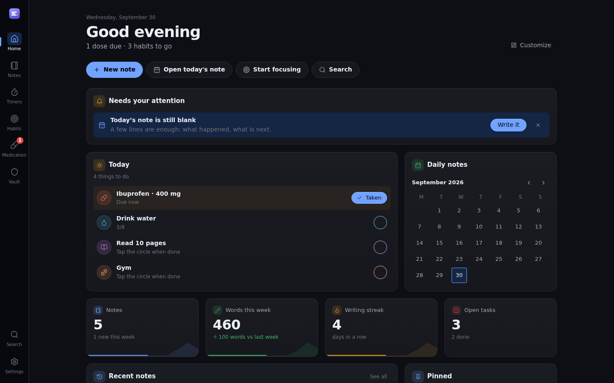
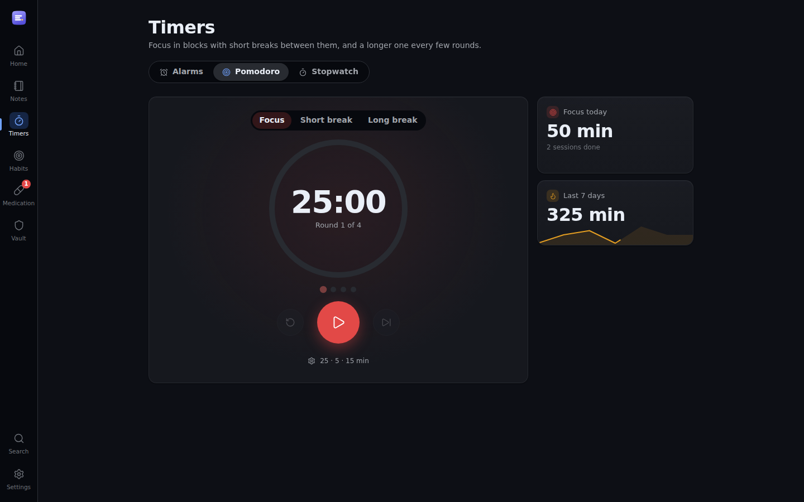
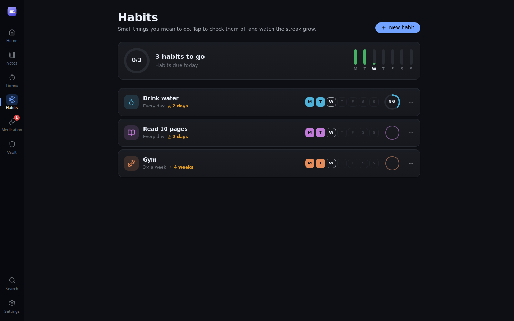

<div align="center">


# Noter

**Your notes, timers, habits, medication and passwords - in one app that never leaves your device.**

[](https://github.com/lukadevv/noter/releases/latest)
[](https://github.com/lukadevv/noter/actions/workflows/ci.yml)
[](LICENSE)


[**Open the web app**](https://noter.lukadevv.com) ·
[**Download**](https://github.com/lukadevv/noter/releases/latest) ·
[Privacy](https://noter.lukadevv.com/privacy.html) ·
[Report a bug](https://github.com/lukadevv/noter/issues)



</div>

## Why Noter

- **Local-first.** Everything lives in IndexedDB on your device. No account, no
  server, no tracking. It works offline, and a backup is one file you own.
- **One place for the day.** Home gathers what matters today - doses due,
  habits to tick, timers running, notes you were writing - and lets you act on
  them right there.
- **Everywhere, one codebase.** The website _is_ the app; the Windows, macOS,
  Linux and Android builds wrap that same code, so they never drift apart.

## What's inside

<table>
<tr>
<td width="50%" valign="top">

### 🏠 Home

A dashboard that arranges itself without gaps: a **Today** list you can act on
(log a dose, tick a habit), a daily-notes calendar, writing statistics with
sparklines, recent and pinned notes, quick-start timers and focus minutes.
Every block can be hidden or reordered.

### 📝 Notes

Markdown built from blocks: type `/` for checklists, callouts, tables, code, a
kanban **board** or an image **gallery**. `[[Wiki links]]` with backlinks,
`#tags`, smart folders from queries like `tag:bug AND is:todo`, version history,
per-folder encryption and share-as-a-link without a server.

### ⏱️ Timers

Three tools in one place:

- **Alarms** - one-tap countdowns you colour and reorder, with synthesised sounds
  you can **preview before choosing** (or design yourself)
- **Pomodoro** - focus and breaks with a long break every few rounds, optional
  auto-start, and your focus minutes charted
- **Stopwatch** - hundredths, laps with the fastest and slowest marked, and it
  keeps running if you close the app

</td>
<td width="50%" valign="top">

### 🎯 Habits

Every day, on some weekdays, or _n_ times a week - with counted targets for
things like glasses of water. Tap to tick, watch the streak, open the 17-week
history, and get a reminder at the time you pick if it is not done yet.

### 💊 Medication

"Every 12 hours" timed from the dose you actually took, a heads-up before the
next one, adherence and stock. Logging a dose **earlier than scheduled asks
first** and shows what was already taken - so a double tap is not a double dose.

### 🔐 Vault

Logins, cards, secure notes and Wi-Fi passwords behind a master password
(AES-GCM, PBKDF2). It locks itself when idle or hidden, and copied secrets are
wiped from the clipboard.

### 🎨 Yours

Eight themes plus a theme editor, per-folder accent colours, density, fonts,
animations (system, full, reduced or off), ten languages including right-to-left
Arabic, and a welcome tour you can replay any time.

</td>
</tr>
</table>

<p align="center">
  
  
</p>

## Download

| Platform    | Get it                                                                                                 | Updates                                    |
| ----------- | ------------------------------------------------------------------------------------------------------ | ------------------------------------------ |
| **Web**     | [noter.lukadevv.com](https://noter.lukadevv.com) - install it from the browser as an app               | Automatic, with a prompt before reloading  |
| **Windows** | Microsoft Store, or `.exe` / `.msi` from [Releases](https://github.com/lukadevv/noter/releases/latest) | Store: by the Store · installer: in-app    |
| **macOS**   | `.dmg` (Apple silicon and Intel)                                                                       | In-app                                     |
| **Linux**   | `.AppImage`, `.deb` or `.rpm`                                                                          | AppImage: in-app · `.deb`/`.rpm`: notified |
| **Android** | `.apk` from [Releases](https://github.com/lukadevv/noter/releases/latest)                              | Notified, with a link to the new `.apk`    |

How each build finds out about new versions is described in
[docs/updates.md](docs/updates.md).

## Keeping your data

- **Portable `.noter` file** - the whole workspace in one file, optionally
  encrypted, to move between devices
- **Markdown archive** - a zip of readable `.md` files plus images
- **Automatic backups** to a folder on disk (Chrome and Edge)
- **Per-note history** with a line diff and restore

Browsers can evict site data (Safari after seven days without a visit), so set
up a backup. Encryption passphrases are never stored: forget one and those notes
cannot be recovered.

---

# For developers

## Getting started

This project uses **pnpm**. The version is pinned in `package.json`, so the
simplest way to get the right one is Corepack, which ships with Node:

```bash
corepack enable
pnpm install
pnpm dev
```

Other package managers are rejected by a `preinstall` guard
(`scripts/only-pnpm.mjs`). That is not gatekeeping: the lockfile is
`pnpm-lock.yaml`, and pnpm's symlinked `node_modules` layout surfaces missing
dependency declarations that npm's flat layout hides. An install from npm or
yarn would build something that does not match CI.

## Commands

| Command                      | What it does                                                      |
| ---------------------------- | ----------------------------------------------------------------- |
| `pnpm dev`                   | Dev server with hot reload                                        |
| `pnpm build`                 | Type-check, build to `dist/`, and enforce the bundle budget       |
| `pnpm build:fast`            | Build without the type-check and budget gate                      |
| `pnpm preview`               | Serve the production build locally                                |
| `pnpm check`                 | `svelte-check` over the whole project                             |
| `pnpm test`                  | Unit tests (Vitest)                                               |
| `pnpm test:e2e`              | End-to-end tests (Playwright)                                     |
| `pnpm test:e2e:ui`           | Playwright's interactive runner                                   |
| `pnpm test:all`              | Unit tests, then end-to-end                                       |
| `pnpm screenshots`           | Retake the screenshots in every language (`docs/screenshots/`)    |
| `node scripts/gen-icons.mjs` | Regenerate every icon and the social card from `scripts/logo.mjs` |
| `pnpm desktop:dev`           | Run the app in the desktop shell, with hot reload                 |
| `pnpm desktop:build`         | Build the desktop installers for the current platform             |
| `pnpm android:sync`          | Build the web assets and copy them into the Android project       |
| `pnpm android:open`          | Open the Android project in Android Studio                        |

Run one-off binaries with `pnpm exec`, never `npx`. The first e2e run needs the
browser: `pnpm exec playwright install chromium`.

## Keyboard

| Shortcut            | Action                                         |
| ------------------- | ---------------------------------------------- |
| `Ctrl+K`            | Command palette                                |
| `Ctrl+N`            | New note                                       |
| `Ctrl+,`            | Settings                                       |
| `Ctrl+Shift+D`      | Today's daily note                             |
| `Ctrl+Shift+Space`  | Scratchpad                                     |
| `Ctrl+Shift+L`      | Lock or unlock editing                         |
| `Ctrl+1` … `Ctrl+6` | Home, Notes, Timers, Habits, Medication, Vault |
| `Ctrl+\`            | Hide or show the folders                       |

## Architecture

```
src/
  lib/
    db/       Dexie schema and repositories (the only code that touches IndexedDB)
    md/       Markdown rendering, tasks, boards, tags and wiki-links
    editor/   CodeMirror setup and decorations, loaded through a dynamic import
    images/   Ingest, WebP re-encoding, thumbnails, object-URL cache
    search/   Query language, evaluator, MiniSearch index
    theme/    OKLCH colour maths, token derivation, presets
    crypto/   PBKDF2 + AES-GCM, and the in-memory keyring
    backup/   Markdown archive, portable vault, File System Access
    share/    URL-fragment encoding
    timers/   Alarms, the pomodoro cycle and the stopwatch
    habits/   Habit schedules, streaks and their store
    meds/     Dose schedule, adherence and the "too early?" check
    home/     The hole-free dashboard layout
    platform/ Native shells: files, notifications, updates
    stores/   Svelte 5 rune stores: notes, theme, UI, confirm, lightbox
  components/ UI
  routes/     Hash router
```

Four conventions hold the project together:

1. **No component hardcodes a colour.** Every value resolves through a CSS custom
   property declared in `src/app.css` and written at runtime by
   `src/lib/theme/apply.ts`. That is what makes runtime theming possible.
2. **Only `src/lib/db/` talks to IndexedDB.** Components go through the stores,
   stores go through the repositories.
3. **The markdown is the source of truth.** Tags, tasks, boards, galleries and
   links are all read out of the text. `Note.tags` is a denormalised copy that
   exists only so IndexedDB can index it.
4. **Anything heavy is behind a dynamic import.** The editor, the markdown
   renderer, the icon catalogue, the backup codecs and the share encoder are all
   separate chunks.

## Testing

**Unit tests** (`tests/`, Vitest) cover the pure logic and the database layer:
the query language, markdown and board parsing, OKLCH colour maths, fractional
ordering, the crypto envelope, the vault file format, and the repositories
against `fake-indexeddb`.

**End-to-end tests** (`e2e/`, Playwright) drive the real app in Chromium against
the production build, so the service worker, the injected CSP and the code-split
chunks are all exercised as they ship:

| Spec                 | What it covers                                                                                 |
| -------------------- | ---------------------------------------------------------------------------------------------- |
| `notes.spec.ts`      | Notes and folders, trash, archive, pinning, bulk actions, persistence across reloads           |
| `images.spec.ts`     | Paste-to-store pipeline, deduplication, gallery, lightbox, orphan cleanup                      |
| `search.spec.ts`     | Command palette, tags, structured queries, smart folders, wiki-links, backlinks, completion    |
| `crypto.spec.ts`     | Folder encryption, unlock, wrong passphrase, and that no plaintext leaks into IndexedDB        |
| `backup.spec.ts`     | Vault round-trip into a clean browser, merge semantics, Markdown archive, history, share links |
| `offline.spec.ts`    | Offline reload, cached manifest, CSP, and that heavy chunks stay lazy                          |
| `home.spec.ts`       | The dashboard, its widgets and the daily-note reminder                                         |
| `timers.spec.ts`     | Alarms ringing anywhere, presets, sound previews, a full pomodoro round, stopwatch laps        |
| `habits.spec.ts`     | Creating habits, counted targets, ticking them off from Home, confirmation before deleting     |
| `meds.spec.ts`       | Logging doses, undo, the confirmation for a dose that comes too early, stock                   |
| `tour.spec.ts`       | The welcome tour: offered once, navigates each area, skippable and replayable                  |
| `vault.spec.ts`      | Master password, entries, auto-lock and that nothing is stored in the clear                    |
| `responsive.spec.ts` | Single-pane stack on a phone viewport (runs under the `mobile` project)                        |

Two conventions keep the suite honest:

- **Wait on state, never on time.** `settleAutosave` reads IndexedDB directly
  rather than trusting the note list, because the list updates optimistically
  while the write is on a 400 ms debounce - waiting on the DOM alone races it.
- **Assert on effects, not on appearances.** The encryption spec greps the object
  store for a canary string; the lazy-loading spec watches network requests; the
  backup spec restores into a brand-new browser context with an empty origin.

`E2E_DEV=1 pnpm test:e2e` runs against the dev server instead, which is faster
when iterating (the offline spec skips itself there, since there is no service
worker).

**Screenshots** are generated, not taken by hand. `pnpm screenshots` fills a
fresh browser with demo content (`e2e/screenshots/demo-data.ts`), pins the clock
to a Wednesday evening and photographs Home, Medication, Habits and the Pomodoro
in each language, into `docs/screenshots/<locale>/`. Add `--grep es` to retake a
single language. It is a separate Playwright config, so `pnpm test:e2e` never
runs it.

**Linting and formatting** are split: ESLint covers what a type checker does not
see - unsafe patterns, dead code, accessibility in markup - while Prettier owns
formatting entirely. `pnpm verify` runs everything CI runs except the browser
suite.

## Branding assets

The logo is drawn in code, in `scripts/logo.mjs`: a squircle in the brand
gradient holding three rounded bars (the blocks of a note) and a dot at the end
of the last one (the cursor). `scripts/gen-icons.mjs` renders it with resvg into
`assets/logo.svg`, `assets/logo-1024.png` and everything below, all committed, so
a clone builds without any image tooling:

| Output                                                        | Used for                                                         |
| ------------------------------------------------------------- | ---------------------------------------------------------------- |
| `favicon.ico`, `icons/favicon-16.png`, `icons/favicon-32.png` | Browser tabs and OS shortcuts                                    |
| `icons/icon-192.png`, `icons/icon-512.png`                    | PWA icons with `purpose: any`                                    |
| `icons/maskable-192.png`, `icons/maskable-512.png`            | Android, which crops to its own shape                            |
| `icons/apple-touch-icon.png`                                  | iOS home screen (opaque; iOS composites transparency onto black) |
| `icons/logo-64.png`                                           | The brand mark in the sidebar                                    |
| `android/…/mipmap-*/ic_launcher*.png`                         | The Android launcher, flat and adaptive layers                   |
| `og.png`                                                      | Link previews (1200×630)                                         |
| `src-tauri/windows/msix/Assets/*`                             | Microsoft Store (MSIX) tiles, store logo and splash screen       |

The maskable and Apple icons are full-bleed: those platforms apply their own
mask, so an icon with rounded corners of its own gets clipped twice and looks
smaller than its neighbours.

The desktop shell keeps its own set, in the `.ico` and `.icns` containers
Windows and macOS want. Those come from Tauri's own converter and change only
when the logo does:

```bash
pnpm exec tauri icon assets/logo-1024.png -o src-tauri/icons
rm -rf src-tauri/icons/android src-tauri/icons/ios
```

**Link previews need an absolute URL.** Set `VITE_SITE_URL` when building for a
real deployment:

```bash
VITE_SITE_URL=https://your-domain.example pnpm build
```

Without it the Open Graph tags fall back to relative paths, which most scrapers
ignore - previews simply do not appear, rather than pointing somewhere wrong.

## Search engines

The build emits everything a crawler needs, all of it derived from
`src/lib/seo.ts` so the description and feature list live in one place:

- **JSON-LD** describing the app as a `SoftwareApplication`, including the
  explicit zero-price offer that marks it as free, the ten supported languages,
  and a feature list
- **Open Graph and Twitter** tags with a 1200×630 card, plus `og:locale`
  alternates for every language
- **`robots.txt`** and a one-entry **`sitemap.xml`**, both with the origin filled
  in at build time
- A **canonical link**, emitted only when `VITE_SITE_URL` is set

There is deliberately no `hreflang`: the interface language is a per-visitor
setting, not a URL, so advertising per-language addresses would promise pages
that do not exist.

**Google Search Console.** Either set `VITE_GOOGLE_SITE_VERIFICATION` to the
token from the HTML-tag method - the tag is only emitted when it has a value -
or drop Google's verification HTML file into `public/`, from where it ships at
the site root. Submit `https://your-domain/sitemap.xml` once verified.

**Cloudflare Web Analytics.** Set `VITE_CLOUDFLARE_ANALYTICS_TOKEN` to the site
token shown in your Web Analytics dashboard. Only the token value, not the whole
snippet. When set, the build injects the beacon script and the CSP opens the
`static.cloudflareinsights.com` origin it loads from. It is skipped on the
desktop and Android builds, which share this `index.html` yet are not web
traffic.

## Bundle budget

`pnpm build` fails if the initial payload exceeds 150 KB gzipped.
`scripts/check-budget.mjs` reads `dist/index.html` to tell the initial payload from
lazily loaded chunks and prints both.

## Deploying

`pnpm build` produces `dist/`, which is plain static files - any static host will
do. The app uses hash routing, so no rewrite rules are needed.

`public/_headers` carries the response headers that a `<meta>` tag cannot set:
`frame-ancestors`, which browsers ignore in markup, and `Cache-Control: no-cache`
on `sw.js`, without which a client can get stuck on an old service worker
indefinitely. Cloudflare Pages and Netlify read that file directly; on other
hosts, translate it into their configuration.

### Cloudflare Pages

`.github/workflows/ci.yml` deploys on every push to `main`, but only after lint,
types, the bundle budget, unit tests and the end-to-end suite have all passed.

Configure these in the repository's **Settings → Secrets and variables → Actions**:

| Kind     | Name                      | Value                                                |
| -------- | ------------------------- | ---------------------------------------------------- |
| Secret   | `CLOUDFLARE_API_TOKEN`    | A token with the _Cloudflare Pages: Edit_ permission |
| Secret   | `CLOUDFLARE_ACCOUNT_ID`   | From the Cloudflare dashboard sidebar                |
| Variable | `CLOUDFLARE_PROJECT_NAME` | The Pages project name, e.g. `noter`                 |
| Variable | `SITE_URL`                | The deployed origin, e.g. `https://noter.pages.dev`  |

`SITE_URL` only affects link previews. Everything else works without it - see
`.env.example`, which documents every variable the build reads.

Create the Pages project once (dashboard → Workers & Pages → Create → Pages →
_Direct Upload_); the workflow uploads to it from then on, so Cloudflare never
needs to build the project itself.

## Downloadable builds

The website is the whole app, so the desktop and Android builds are that same
`dist/` folder loaded from local storage instead of over the network, inside a
system webview. There is no second implementation to keep in step - only a shell
around the one that already exists.

| Target                | Shell                  | Output                                           |
| --------------------- | ---------------------- | ------------------------------------------------ |
| Windows, macOS, Linux | Tauri 2 (`src-tauri/`) | `.exe`/`.msi`, `.dmg`, `.AppImage`/`.deb`/`.rpm` |
| Android               | Capacitor (`android/`) | `.apk` to sideload, `.aab` for the Play Store    |

iOS is deliberately absent. Apple allows no distribution outside the App Store,
so an `.ipa` on a releases page would be a file nobody could install; on iOS the
PWA installed from Safari is the native build.

### What changes inside a shell

Three things, all in `src/lib/platform/`:

- **Saving files.** A webview has no download manager behind an `<a download>`
  link - clicking one does nothing at all. Exports go through a save dialog on
  the desktop and the share sheet on Android, which is what lets a file reach
  Downloads or Drive from a sandboxed app without asking for storage permissions.
- **The service worker** is not registered. The shell already carries the whole
  app on disk; a second, staler copy that outlives the installer helps nobody.
- **The Content-Security-Policy** meta tag is left out of the desktop build,
  because Tauri applies the policy from `tauri.conf.json` and that one has to
  allow the IPC protocol the browser policy knows nothing about. Android keeps
  the web policy unchanged.

Automatic backups to a folder use the File System Access API, which no webview
outside Chromium implements. The app already treats that as an optional
capability and falls back to manual exports, so the shells simply take the path
Firefox and Safari take.

### Building locally

The desktop shell needs a [Rust toolchain](https://rustup.rs) and, on Linux, the
webview development packages (`libwebkit2gtk-4.1-dev`, `librsvg2-dev`,
`libxdo-dev`, `patchelf`, `build-essential`). Then:

```bash
pnpm desktop:dev      # hot reload, Vite behind a native window
pnpm desktop:build    # installers in src-tauri/target/release/bundle/
```

The Android shell needs JDK 21 and the Android SDK - installing Android Studio
gets both:

```bash
pnpm android:sync     # build dist/ and copy it into android/
pnpm android:open     # then run or build from Android Studio
```

Version numbers come from `package.json` alone: `scripts/sync-native-version.mjs`
stamps it into `tauri.conf.json`, and `android/app/build.gradle` reads it
directly, packing `1.4.2` into the always-increasing `versionCode` 10402 that
Android requires.

### Cutting a release

Bump `version` in `package.json`, commit, and push a matching tag:

```bash
git tag v1.1.0 && git push origin v1.1.0
```

`.github/workflows/release.yml` takes it from there. It refuses tags that
disagree with `package.json`, creates one draft release, builds Linux, Windows
(plus the Store `.msix`) and a universal macOS binary in parallel, adds the
Android artefacts, and only then publishes the release. Nothing appears
half-finished on the releases page, because the draft is what everything
uploads into.

Everything below is optional: each step that needs a key or an account checks
for it and skips itself, with a notice in the log, when it is not configured.

| To get…                             | Configure                                                             | Guide                                                                                       |
| ----------------------------------- | --------------------------------------------------------------------- | ------------------------------------------------------------------------------------------- |
| Android `.apk` / `.aab`             | `ANDROID_KEYSTORE_*` secrets                                          | [below](#android-signing)                                                                   |
| In-app updates on the desktop       | `TAURI_SIGNING_PRIVATE_KEY*` secrets, `TAURI_UPDATER_PUBKEY` variable | [docs/updates.md](docs/updates.md)                                                          |
| The `.msix` for the Microsoft Store | `MSIX_*` variables (from Partner Center)                              | [docs/microsoft-store.md](docs/microsoft-store.md)                                          |
| Automatic Store submissions         | `MS_STORE_*` secrets + `MS_STORE_PRODUCT_ID`                          | [docs/microsoft-store.md](docs/microsoft-store.md#5-automatic-submissions-on-every-release) |

### Publishing to the Microsoft Store by hand

Automatic submissions need a Microsoft Entra ID (Azure AD) app linked to Partner
Center. Without one, the Store update is a manual upload - and it still takes a
single workflow run:

1. **Bump and tag** as above. Only the **Release** workflow is needed: with the
   `MSIX_*` variables set it builds the `.msix` and attaches it to the GitHub
   release. (The separate **MSIX** workflow is only for building the package
   _without_ a release, e.g. for the very first submission.)
2. When the release is published, **download** `Noter_X.Y.Z.0_x64.msix` from its
   assets.
3. In **Partner Center → Apps and games → Noter**, click **Start update** (or
   _Update_ on the existing submission), open **Packages**, remove the old
   package, drag in the new `.msix` and **Save**.
4. Update the release notes under **Store listings** if you like, then **Submit
   for certification**. Certification usually takes a few hours to three days;
   installed copies update themselves once it passes.

Every `.msix` needs a higher version than the last one the Store accepted, which
bumping `package.json` already takes care of. The Store copy never tries to
update itself: the app detects the MSIX install and leaves updates to the Store.

### Android signing

Android needs a signing key, and the same one every time: Android will only
install an update over a package signed with the key the previous one used, so a
key generated per build would strand everyone who installed the last release.
Create one once, keep it somewhere safe, and never commit it:

```bash
keytool -genkeypair -v -keystore noter.keystore -alias noter \
  -keyalg RSA -keysize 2048 -validity 10000
base64 -w0 noter.keystore    # the value for the secret below
```

| Secret                      | Value                             |
| --------------------------- | --------------------------------- |
| `ANDROID_KEYSTORE_BASE64`   | The keystore file, base64-encoded |
| `ANDROID_KEYSTORE_PASSWORD` | The keystore password             |
| `ANDROID_KEY_ALIAS`         | The key alias, e.g. `noter`       |
| `ANDROID_KEY_PASSWORD`      | The key password                  |

Without them the Android job logs a warning and stops, and the release still
ships its desktop builds.

### Code signing

The desktop builds are not code-signed. Windows shows a SmartScreen warning
until the download builds reputation, and macOS asks for the app to be opened
from its right-click menu the first time. Signing them means an Apple Developer
membership and a Windows certificate - a running yearly cost, not a code change,
and the release notes say plainly what to expect until then. (The update key in
[docs/updates.md](docs/updates.md) is a different, free thing: it only proves an
update came from this project.)
